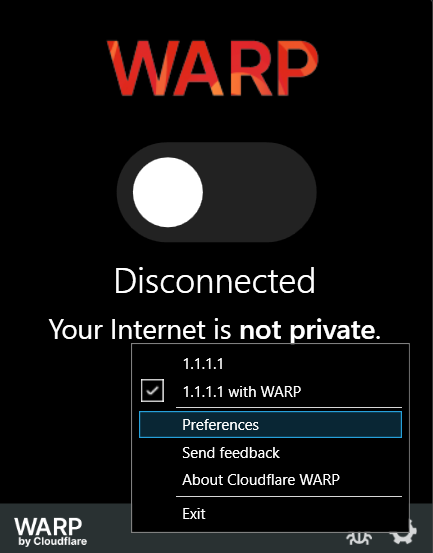

# Accessing Cloudflare Private Networks - Cloudflare Zero Trust \[Duplicate\]

Mungkin beberapa orang ada yang masih kebingungan bagaimana caranya untuk melakukan koneksi Private Networks dari _local network_ kita menggunakan _paltform_ Cloudflare Zero Trust. Oleh karena itu, _guide_ ini di buat sekaligus sebagai catatan pribadi saya tentang bagaimana cara untuk melakukan _setup_ awal terhadap Private Networks yang disediakan dalam layanan Cloudflare Zero Trust.

Untuk _prerequisite_ sebelum menjalankan _guide_ ini, pastikan sebelumnya sudah berhasil untuk menghubungkan Cloudflare Tunnel dengan menggunakan Cloudflared yang guidenya dapat diikuti di dokumentasi Cloudflare [disini](https://developers.cloudflare.com/cloudflare-one/connections/connect-networks/get-started/create-remote-tunnel/).

Sebenarnya, setelah mengikuti _prerequisite_ di atas dari dokumentasi Coludflare, kita sudah diarahkan untuk melakukan _set up_ agar dapat melakukan koneksi dengan _private networks_ kita dari Zero Trust (pada point 2b). Namun sebagai pemula, saya menemukan beberapa kebingungan setelah menjalankan guide tersebut, jadi pada _guide_ kali ini kita akan membahas pada bagian tertentunya saja.

## Routing & Setting Up IP/CIDR Range

Tambahkan _range_ IP dari _server_ yang ingin kita tambahkan dengan langkah berikut:

- Buka tab **Networks** > **Routes**
- Klik tombol **Create route** untuk menambahkan _range_ IP baru
- Tambahkan _range_ IP dengan format `<IP Address>/<prefix length>`

_Prefix length_ disini menggambarkan jumlah bit yang digunakan oleh _network_, dan sisanya adalah jumlah bit yang dapat kita gunakan. Misalkan _prefix length_ kita adalah 8, maka kita mempunya sebanyak 2^(32-8) _IP address_ yang dapat digunakan.

Pada kasus saya, pada _local network homelab server_ saya di _assign_ dengan IP `192.168.1.x`. Berarti _local network_ saya berjalan di _network_ degan IP `192.168.1.0`. Oleh karena itu, kita perlu untuk menambahkan konfigurasi untuk _network_ `192.168.1.0` yang mencakup IP yang di assign ke _server_ kita juga.

Pada kasus ini, saya ingin membuka akses ke seluruh usable IP yang ada di _local network_ saya, sehingga saya akan menggunakan CIDR `192.168.1.0/24`. Sehingga, IP yang dapat di gunakan adalah dari `192.168.1.1` hingga `192.168.1.254`. Walau sebenarnya cukup dengan _prefix length_ sebesar 28 sudah dapat mencakup _homelab server_ saya.

Sebenarnya untuk mempermudah dalam menentukan CIDR kita, terdapat tools seperti [cidr.xyz](https://cidr.xyz/), atau bahkan kita dapat melihat langsung CIDR range kita menggunakan command `ip address` pada CLI Linux kita.

## Configuring Split Tunnel

Agar dapat mengakses IP yang sudah di-_define_ oleh kita pada setting _Routes_ sebelumnya, kita perlu untuk melakukan _setting_ pada Split Tunnel kita dengan beberapa langkahberikut:

- buka tab **Settings** > **WARP Client**
- pada _section_ **Device settings** pada bagian **Profile settings** pilih profile yang ingin di edit Split Tunnelnya dengan menekan tombol kebab kemudian pilih **Configure**.

Secara _default_, Cloudflare sudah meng-_exclude_ IP yang biasanya digunakan secara _private_ dan tidak dapat dijangkau melalui internet pada konfigurasi Split Tunnel nya. Oleh karena itu, Cloudflare meng-_exclude_ IP dengan _range_ `192.168.0.0/16`, yang dimana ini bersinggungan dengan IP tempat _homelab server_ saya di serve. Sehingga saya akan meng-_takeout_ IP _range_ ini dari rule.

Tentu perlu diperhatikan apakah _IP range_ lain yang terdapat pada _rule_ juga bersinggungan dengan _IP yang digunakan_ pada perangkat yang ingin kita hubungan. Untuk mudahnya kita dapat mengecek _range IP_ kita dengan [cidr.xyz](cidr.xyz).

## Device Enrollment Permisison

Sebelum melakukan koneksi dari _Client_ pastikan siapa saja yang dapat mengakses organisasi Zero Trust kita. Dengan beberapa langkah berikut:

- Buka _tab_ **Settings** > **WARP Client**
- Pada **Device enrollment permissions** pilih **Manage**

Pada _section_ **Access policies** tambahkan atau buat baru _policy_ sesuai dengan kebutuhan kita.

## Connecting to private network from Client

Selanjutnya, kita seharusnya sudah dapat melakukan koneksi ke _service_ yang berjalan di _private network_ kita dengan menggunakan bantuan WARP. Untuk konfigurasi pada _device client_ dapat dengan mengikuti langkah berikut:

- Download aplikasi WARP pada _device_ yang ingin dijalankan
- Klik ikon gir pada tampilan _pop up_ WARP dan klik **Preferences** 
- Kemudian pada tampilan _pop up_ baru yang muncul, pilih tab **Account** kemudian klik **Login with Cloudflare Zero Trust**
- Masukkan nama organisasi kita pada Coludflare 
- Setelah itu, lakukan autentikasi menggunakan akun yang sudah sesuai dengan _rule_ yang di-_define_ pada **Device Enrollment Permission**
- Jika autentikasi sukses, _device_ kita sudah mendapatkan _permission_ untuk mengakses Zero Trust

Untuk mencoba apakah _device client_ sudah mendapatkan akses ke _private network_ dapat meng-_hit_ _service_ yang di _serve_ pada _private network_, misalkan itu NGINX, database, **server minecraft :D**, dan lain-lain melalui IP yang ter-_assign_ pada _private network_. Jadi, misalkan _homelab server_ saya di _serve_ pada `192.168.1.8` di rumah, saya dapat mengaksesnya secara langsung di luar rumah dengan IP yang sama.

\*catatan: pada kasus saya, _device client_ belum berhasil untuk melakukan _ping_ melalui _command line_, walaupun sudah berhasi mengakses infrastruktur lainnya dengan lancar. Padahal pada setting **Network** > **Firewall** > **Proxy** sudah meng-_allow_ ICMP

---

#### References

- https://developers.cloudflare.com/cloudflare-one/connections/connect-networks/get-started/create-remote-tunnel/
- https://developers.cloudflare.com/cloudflare-one/connections/connect-networks/private-net/cloudflared/
- https://cidr.xyz/
