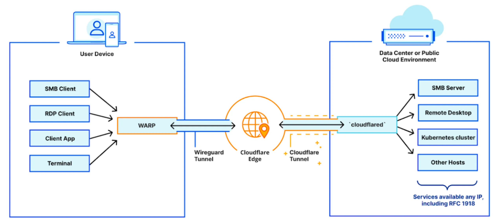
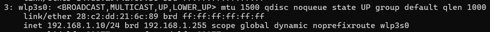

# Accessing Cloudflare Private Networks - Cloudflare Zero Trust

Mungkin beberapa dari kalian ada yang masih kebingungan bagaimana caranya untuk melakukan koneksi Private Networks dari _local network_ kita menggunakan _paltform_ Cloudflare Zero Trust. Oleh karena itu, saya membuat _guide_ ini sekaligus sebagai catatan pribadi saya tentang bagaimana cara untuk melakukan _setup_ awal terhadap Private Networks yang disediakan dalam layanan Cloudflare Zero Trust.

Untuk _prerequisite_ sebelum menjalankan _guide_ ini, pastikan kalian sudah berhasil untuk menghubungkan Cloudflare Tunnel dengan menggunakan Cloudflared yang guidenya dapat kalian ikuti dengan mudah di dokumentasi milik Cloudflare [disini](https://developers.cloudflare.com/cloudflare-one/connections/connect-networks/get-started/create-remote-tunnel/).

Sebenarnya, setelah mengikuti _prerequisite_ di atas dari dokumentasi Coludflare, kita sudah diarahkan untuk melakukan _set up_ agar dapat melakukan koneksi dengan _private networks_ kita dari Zero Trust (pada point 2b). Namun sebagai pemula, saya menemukan beberapa kebingungan setelah menjalankan guide tersebut, jadi pada _guide_ kali ini kita akan membahas pada bagian tertentunya saja.

## Routing & Setting Up IP/CIDR Range

Pada tab Networks > Routes, kita perlu untuk menambahkan _route_. Pada bagian ini kita perlu untuk memberi tahu kepada Cloudflare, di _range_ IP berapa kah tempat _server_ kita di _local network_ kita dengan format `<IP Address>/<prefix length>`. _Prefix length_ disini menggambarkan jumlah bit yang digunakan oleh _network_, dan sisanya adalah jumlah bit yang dapat kita gunakan. Misalkan _prefix length_ kita adalah 8, maka kita mempunya sebanyak 2^(32-8) _IP address_ yang dapat digunakan.

Pada kasus saya, pada _local network homelab server_ saya di _assign_ dengan IP `192.168.1.x`. Berarti _local network_ saya berjalan di _network_ degan IP `192.168.1.0`. Oleh karena itu, kita perlu untuk menambahkan konfigurasi untuk _network_ `192.168.1.0` yang mencakup IP yang di assign ke _server_ kita juga.

Pada kasus ini, saya ingin membuka akses ke seluruh usable IP yang ada di _local network_ saya, sehingga saya akan menggunakan CIDR `192.168.1.0/24`. Sehingga, IP yang dapat di gunakan adalah dari `192.168.1.1` hingga `192.168.1.254`. Walau sebenarnya cukup dengan _prefix length_ sebesar 28 sudah dapat mencakup _homelab server_ saya.

Sebenarnya untuk mempermudah dalam menentukan CIRD kita, terdapat tools seperti [cidr.xyz](https://cidr.xyz/), atau bahkan kita dapat melihat langsung CIRD range kita menggunakan command `ip address` pada CLI Linux kita.

## Route private network IPs through WARP

Agar dapat mengakses IP yang sudah di-_define_ oleh kita pada setting _Routes_ sebelumnya, kita perlu untuk melakukan _routing_ pada tab Settings > WARP Client. Kemudian pada section Device settings pada bagian Profile settings pilih profile yang ingin di edit dengan menekan tombol kebab kemudian pilih Configure.

Secara _default_, Cloudflare sudah meng-_exclude_ IP yang biasanya digunakan secara _private_ dan tidak dapat dijangkau melalui internet.

## Connecting to private network from Client

---

#### References

- https://developers.cloudflare.com/cloudflare-one/connections/connect-networks/get-started/create-remote-tunnel/
- https://developers.cloudflare.com/cloudflare-one/connections/connect-networks/private-net/cloudflared/
- https://cidr.xyz/
