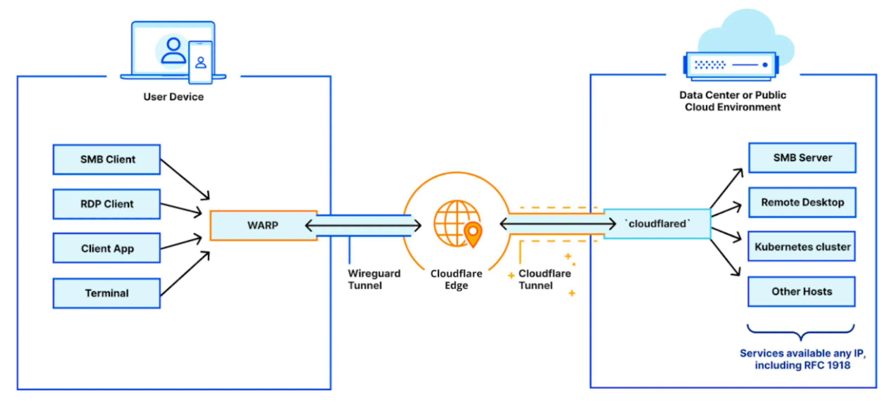

# Accessing Cloudflare Private Networks - Cloudflare Zero Trust

Mungkin beberapa dari kalian ada yang masih kebingungan bagaimana caranya untuk melakukan koneksi Private Networks dari _local network_ kita menggunakan _paltform_ Cloudflare Zero Trust. Oleh karena itu, saya membuat _guide_ ini sekaligus sebagai catatan pribadi saya tentang bagaimana cara untuk melakukan _setup_ awal terhadap Private Networks yang disediakan dalam layanan Cloudflare Zero Trust.

Untuk _prerequisite_ sebelum menjalankan _guide_ ini, pastikan kalian sudah berhasil untuk menghubungkan Cloudflare Tunnel dengan menggunakan Cloudflared yang guidenya dapat kalian ikuti dengan mudah di dokumentasi milik Cloudflare [disini](https://developers.cloudflare.com/cloudflare-one/connections/connect-networks/get-started/create-remote-tunnel/).

Sebenarnya, setelah mengikuti _prerequisite_ di atas dari dokumentasi Coludflare, kita sudah diarahkan untuk melakukan _set up_ agar dapat melakukan koneksi dengan _private networks_ kita dari Zero Trust (pada point 2b). Namun sebagai pemula, saya menemukan beberapa kebingungan setelah menjalankan guide tersebut, jadi pada _guide_ kali ini kita akan membahas pada bagian tertentunya saja.

## Setting Up IP/CIDR Range
